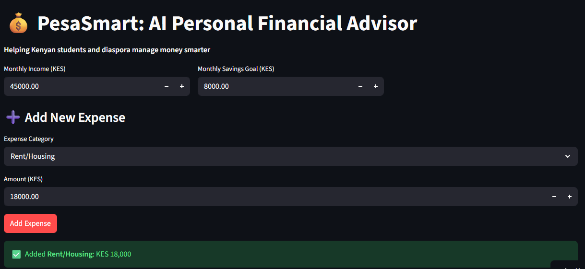
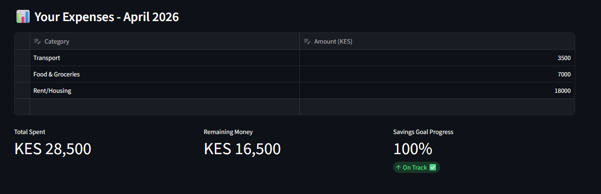
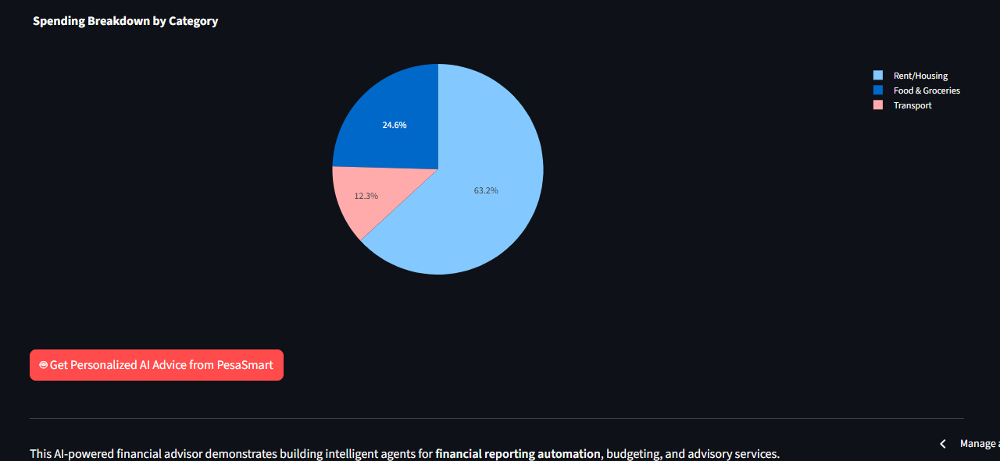

# 💰 PesaSmart: AI Personal Financial Advisor

**Live Demo:** [https://ai-financial-advisorgit.streamlit.app/](https://ai-financial-advisorgit.streamlit.app/)

An intelligent AI-powered budgeting tool designed to help Kenyan university students and the diaspora manage their finances effectively, with a focus on HELB loans, monthly budgeting, and smart spending habits.



## 🎯 Project Overview

PesaSmart allows users to track income and savings goals, log expenses, visualize spending patterns, and receive **personalized AI financial advice** powered by Google Gemini.

It builds on my earlier [PesaShield](https://github.com/Audrey-Okumu/PesaShield.git) project and demonstrates practical application of AI in personal finance and automation.

## ✨ Key Features

- Add, edit, and delete expenses with an interactive table
- Real-time metrics: Total spent, remaining balance, and savings goal progress

- Interactive pie chart for spending breakdown
- Rule-based smart warnings (overspending & low-balance alerts)
- Personalized AI advice tailored to Kenyan context (HELB, M-Pesa, student life, diaspora)

- Clean and responsive Streamlit interface

## 🛠️ Tech Stack

- **Frontend & UI:** Streamlit
- **Data Processing:** Pandas
- **Visualization:** Plotly
- **AI Model:** Google Gemini (gemini-2.5-flash)
- **Environment:** python-dotenv
- **Deployment:** Streamlit Community Cloud

## 🚀 How to Run Locally

```bash
git clone https://github.com/audrey-okumu/ai-financial-advisor.git
cd ai-financial-advisor

python -m venv venv
source venv/bin/activate        # Windows: venv\Scripts\activate

pip install -r requirements.txt

# Create .env file and add your Gemini API key
echo "GEMINI_API_KEY=your_gemini_api_key_here" > .env

streamlit run app.py
